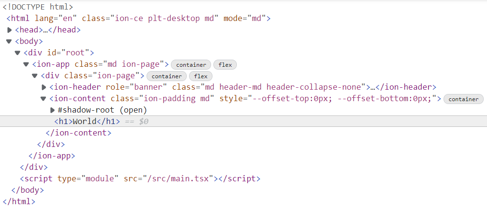
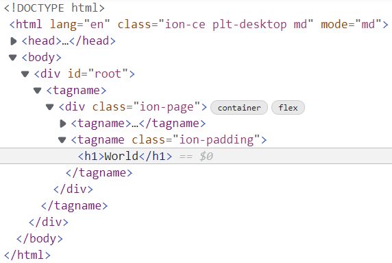

Simple Ionic 6 + ViteJS app
===========================

This repository contains a simple React application that uses ViteJS template and  Ionic 6 (RC2). It demonstrates issue with `vite serve` (as of November 16, 2021).

Creation steps
--------------

I tried to stay as close to the original ViteJS template as possible:

```sh
# use ViteJS's "react-ts" template
cd /work/directory
yarn create vite ionic-simplevitejs --template react-ts

# add Ionic 6 RC2
cd ./ionic-simplevitejs
yarn && yarn add --dev @ionic/react@next

# open in editor
# - add "Hello World" page to "App.tsx"
# - remove unused files
# - simplify "main.tsx"
# - fix TypeScript build issue ("skipLibCheck" in "tsconfig.json")
code .
```

Development mode
----------------

When running the web application in development mode, everything works as expected:

```sh
# start ViteJS development server
yarn dev
```

The DOM contains all the Ionic elements, as expected:



Production mode
---------------

However, when I run the web application in production mode (ViteJS's preview), the page is not rendered correctly:

```sh
# build distribution files and start ViteJS preview server
yarn build && yarn serve
```

The DOM explains why the page doesn't look right -- all `ion-...` elements are replaced with `tagname` elements, and shadow DOM nodes are missing:


